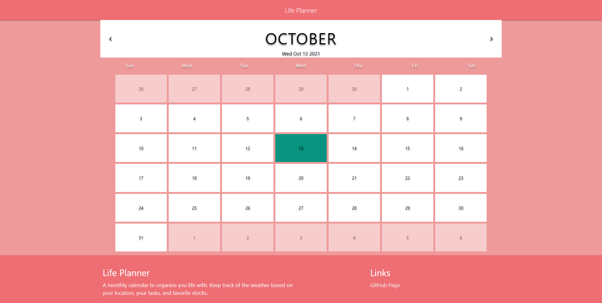

# LifePlanner

1. On this page, you can manage your schedule by month.

2. The main page shows the monthly calendar for the current month. And you can browse the previous or next month.

3. Click on the date you want, and the sidebar presents all specific information you might need.
    - You can check holidays.
    - You can check the weather forecasts for the next 7 days as well as today's weather based on your current location.
    - You can see S&P index for that day.

4. Also, you can customize the schedule through the input from the side bar.
    - You can insert and delete your personal events. It exists in you local storage.
    - If you set your favorite stock, it also presents the price of the stock. And it will last until you change your stock.

5. On the footer displays the webpage description and GitHub page link.

# Resources used
Base of Calender (https://github.com/lashaNoz/Calendar)
CSS Libary used (https://materializecss.com/)

# APIs used
Weather APIs
(https://openweathermap.org/api)

Holiday APIs
(https://calendarific.com/api-documentation)

Financial APIs
(https://financialmodelingprep.com/developer/docs#Stock-Historical-Price)
(https://financialmodelingprep.com/developer/docs/realtime-stock-quote-api)
(https://financialmodelingprep.com/developer/docs#Stock-Screener)

# Link To Deployed Website
(https://schristinelagrange.github.io/lifePlanner/)

# Presentation Link
(https://docs.google.com/presentation/d/1RQ9Uwj78dQtANnG1htISJCRMa7O_hsqe1elH9vbnyHo/edit#slide=id.p)

